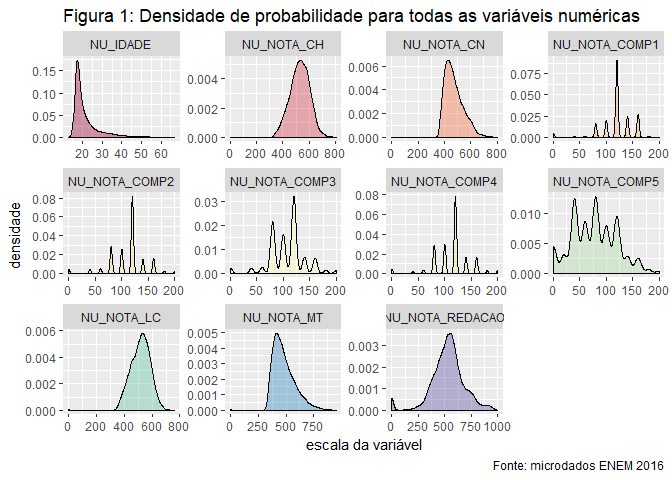
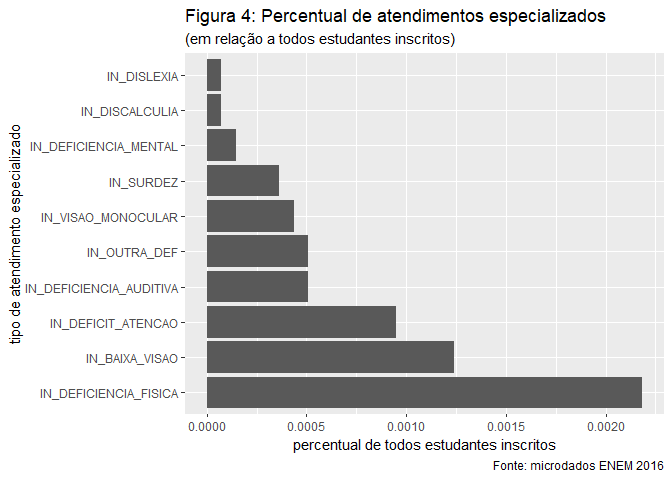
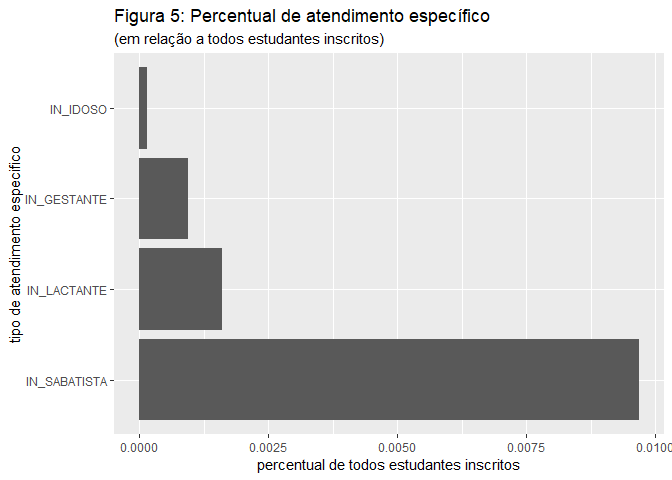
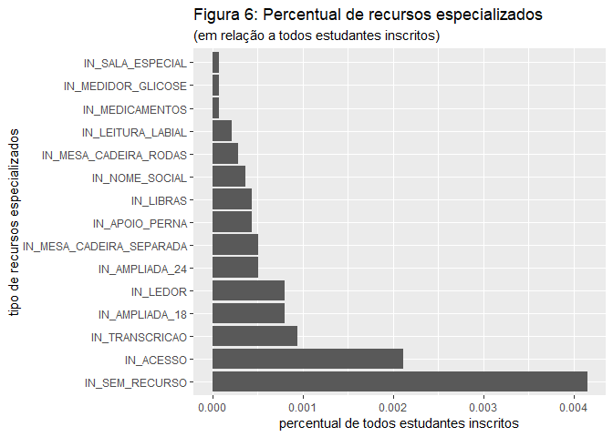
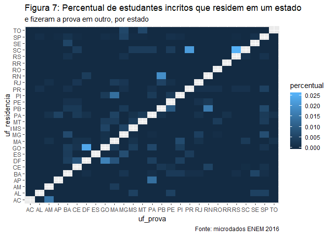
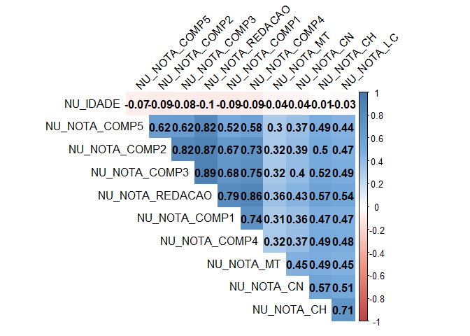
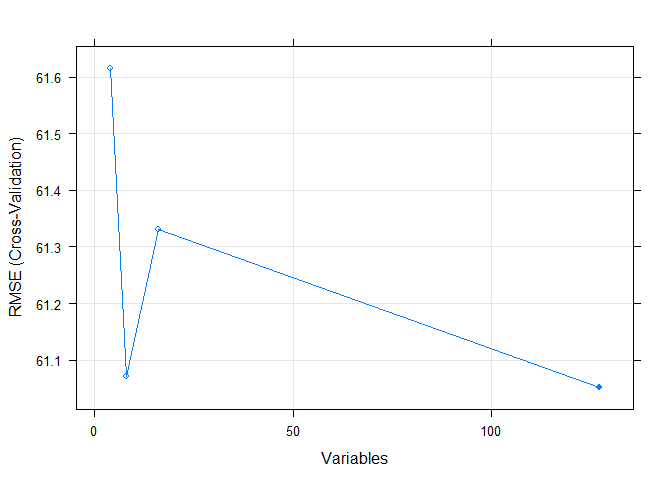
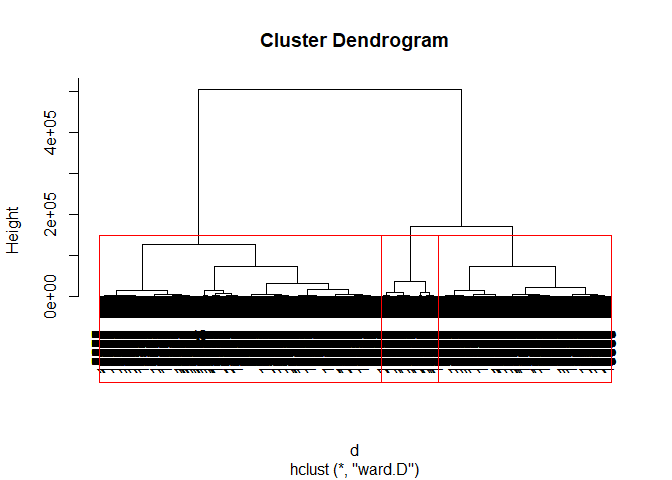

## Análise exploratória microdados ENEM 2016


Iniciamos lendo a base de dados.

```r
dados = fread("D:/Users/sb044936/Desktop/Microdados_Enem_2016.csv", sep = ",", encoding = "UTF-8", na.strings = "")
```


```r
dim(dados)
```

```
## [1] 13730   167
```
A base contém 13730 linhas e 167 colunas.

```r
# verifying column classes
sapply(dados, class)
```

```
##                          V1                NU_INSCRICAO 
##                   "integer"                 "character" 
##                      NU_ANO     CO_MUNICIPIO_RESIDENCIA 
##                   "integer"                   "integer" 
##     NO_MUNICIPIO_RESIDENCIA            CO_UF_RESIDENCIA 
##                 "character"                   "integer" 
##            SG_UF_RESIDENCIA                    NU_IDADE 
##                 "character"                   "integer" 
##                     TP_SEXO             TP_ESTADO_CIVIL 
##                 "character"                   "integer" 
##                 TP_COR_RACA            TP_NACIONALIDADE 
##                   "integer"                   "integer" 
##     CO_MUNICIPIO_NASCIMENTO     NO_MUNICIPIO_NASCIMENTO 
##                   "integer"                 "character" 
##            CO_UF_NASCIMENTO            SG_UF_NASCIMENTO 
##                   "integer"                 "character" 
##             TP_ST_CONCLUSAO             TP_ANO_CONCLUIU 
##                   "integer"                   "integer" 
##                   TP_ESCOLA                   TP_ENSINO 
##                   "integer"                   "integer" 
##                IN_TREINEIRO                   CO_ESCOLA 
##                   "integer"                   "integer" 
##            CO_MUNICIPIO_ESC            NO_MUNICIPIO_ESC 
##                   "integer"                 "character" 
##                   CO_UF_ESC                   SG_UF_ESC 
##                   "integer"                 "character" 
##      TP_DEPENDENCIA_ADM_ESC          TP_LOCALIZACAO_ESC 
##                   "integer"                   "integer" 
##             TP_SIT_FUNC_ESC              IN_BAIXA_VISAO 
##                   "integer"                   "integer" 
##                 IN_CEGUEIRA                   IN_SURDEZ 
##                   "integer"                   "integer" 
##     IN_DEFICIENCIA_AUDITIVA           IN_SURDO_CEGUEIRA 
##                   "integer"                   "integer" 
##       IN_DEFICIENCIA_FISICA       IN_DEFICIENCIA_MENTAL 
##                   "integer"                   "integer" 
##          IN_DEFICIT_ATENCAO                 IN_DISLEXIA 
##                   "integer"                   "integer" 
##              IN_DISCALCULIA                  IN_AUTISMO 
##                   "integer"                   "integer" 
##          IN_VISAO_MONOCULAR                IN_OUTRA_DEF 
##                   "integer"                   "integer" 
##                IN_SABATISTA                 IN_GESTANTE 
##                   "integer"                   "integer" 
##                 IN_LACTANTE                    IN_IDOSO 
##                   "integer"                   "integer" 
## IN_ESTUDA_CLASSE_HOSPITALAR              IN_SEM_RECURSO 
##                   "integer"                   "integer" 
##                  IN_BRAILLE              IN_AMPLIADA_24 
##                   "integer"                   "integer" 
##              IN_AMPLIADA_18                    IN_LEDOR 
##                   "integer"                   "integer" 
##                   IN_ACESSO              IN_TRANSCRICAO 
##                   "integer"                   "integer" 
##                   IN_LIBRAS           IN_LEITURA_LABIAL 
##                   "integer"                   "integer" 
##       IN_MESA_CADEIRA_RODAS    IN_MESA_CADEIRA_SEPARADA 
##                   "integer"                   "integer" 
##              IN_APOIO_PERNA          IN_GUIA_INTERPRETE 
##                   "integer"                   "integer" 
##                     IN_MACA               IN_COMPUTADOR 
##                   "integer"                   "integer" 
##         IN_CADEIRA_ESPECIAL          IN_CADEIRA_CANHOTO 
##                   "integer"                   "integer" 
##       IN_CADEIRA_ACOLCHOADA            IN_PROVA_DEITADO 
##                   "integer"                   "integer" 
##         IN_MOBILIARIO_OBESO           IN_LAMINA_OVERLAY 
##                   "integer"                   "integer" 
##       IN_PROTETOR_AURICULAR          IN_MEDIDOR_GLICOSE 
##                   "integer"                   "integer" 
##           IN_MAQUINA_BRAILE                  IN_SOROBAN 
##                   "integer"                   "integer" 
##              IN_MARCA_PASSO                    IN_SONDA 
##                   "integer"                   "integer" 
##             IN_MEDICAMENTOS          IN_SALA_INDIVIDUAL 
##                   "integer"                   "integer" 
##            IN_SALA_ESPECIAL        IN_SALA_ACOMPANHANTE 
##                   "integer"                   "integer" 
##    IN_MOBILIARIO_ESPECIFICO      IN_MATERIAL_ESPECIFICO 
##                   "integer"                   "integer" 
##              IN_NOME_SOCIAL              IN_CERTIFICADO 
##                   "integer"                   "integer" 
##    NO_ENTIDADE_CERTIFICACAO CO_UF_ENTIDADE_CERTIFICACAO 
##                 "character"                   "integer" 
## SG_UF_ENTIDADE_CERTIFICACAO          CO_MUNICIPIO_PROVA 
##                 "character"                   "integer" 
##          NO_MUNICIPIO_PROVA                 CO_UF_PROVA 
##                 "character"                   "integer" 
##                 SG_UF_PROVA              TP_PRESENCA_CN 
##                 "character"                   "integer" 
##              TP_PRESENCA_CH              TP_PRESENCA_LC 
##                   "integer"                   "integer" 
##              TP_PRESENCA_MT                 CO_PROVA_CN 
##                   "integer"                 "character" 
##                 CO_PROVA_CH                 CO_PROVA_LC 
##                 "character"                 "character" 
##                 CO_PROVA_MT                  NU_NOTA_CN 
##                 "character"                   "numeric" 
##                  NU_NOTA_CH                  NU_NOTA_LC 
##                   "numeric"                   "numeric" 
##                  NU_NOTA_MT             TX_RESPOSTAS_CN 
##                   "numeric"                 "character" 
##             TX_RESPOSTAS_CH             TX_RESPOSTAS_LC 
##                 "character"                 "character" 
##             TX_RESPOSTAS_MT                   TP_LINGUA 
##                 "character"                   "integer" 
##              TX_GABARITO_CN              TX_GABARITO_CH 
##                 "character"                 "character" 
##              TX_GABARITO_LC              TX_GABARITO_MT 
##                 "character"                 "character" 
##           TP_STATUS_REDACAO               NU_NOTA_COMP1 
##                   "integer"                   "integer" 
##               NU_NOTA_COMP2               NU_NOTA_COMP3 
##                   "integer"                   "integer" 
##               NU_NOTA_COMP4               NU_NOTA_COMP5 
##                   "integer"                   "integer" 
##             NU_NOTA_REDACAO                        Q001 
##                   "integer"                 "character" 
##                        Q002                        Q003 
##                 "character"                 "character" 
##                        Q004                        Q005 
##                 "character"                   "integer" 
##                        Q006                        Q007 
##                 "character"                 "character" 
##                        Q008                        Q009 
##                 "character"                 "character" 
##                        Q010                        Q011 
##                 "character"                 "character" 
##                        Q012                        Q013 
##                 "character"                 "character" 
##                        Q014                        Q015 
##                 "character"                 "character" 
##                        Q016                        Q017 
##                 "character"                 "character" 
##                        Q018                        Q019 
##                 "character"                 "character" 
##                        Q020                        Q021 
##                 "character"                 "character" 
##                        Q022                        Q023 
##                 "character"                 "character" 
##                        Q024                        Q025 
##                 "character"                 "character" 
##                        Q026                        Q027 
##                 "character"                 "character" 
##                        Q028                        Q029 
##                 "character"                   "integer" 
##                        Q030                        Q031 
##                   "integer"                   "integer" 
##                        Q032                        Q033 
##                   "integer"                   "integer" 
##                        Q034                        Q035 
##                   "integer"                   "integer" 
##                        Q036                        Q037 
##                   "integer"                   "integer" 
##                        Q038                        Q039 
##                   "integer"                   "integer" 
##                        Q040                        Q041 
##                   "integer"                   "integer" 
##                        Q042                        Q043 
##                 "character"                 "character" 
##                        Q044                        Q045 
##                 "character"                 "character" 
##                        Q046                        Q047 
##                 "character"                 "character" 
##                        Q048                        Q049 
##                 "character"                 "character" 
##                        Q050 
##                 "character"
```

Verificando a classe das colunas, nota-se que muitos indicadores estão sendo lidos como numéricos. Devem ser lidos como um caractere. Adiciona-se aos dados faltantes, a palavra "missing", visto que é também um nível e sua análise é de suma importância.

```r
# transforming features to character
dados = dados %>% mutate_at(vars(starts_with("Q0")), list(~as.character))
dados = dados %>% mutate_at(vars(starts_with("TP")), list(~as.character))
dados = dados %>% mutate_at(vars(starts_with("IN")), list(~as.character))
# counting NA cells for each column
sapply(dados, function(x) sum(is.na(x)))
```

```
##                          V1                NU_INSCRICAO 
##                           0                           0 
##                      NU_ANO     CO_MUNICIPIO_RESIDENCIA 
##                           0                           0 
##     NO_MUNICIPIO_RESIDENCIA            CO_UF_RESIDENCIA 
##                           0                           0 
##            SG_UF_RESIDENCIA                    NU_IDADE 
##                           0                           0 
##                     TP_SEXO             TP_ESTADO_CIVIL 
##                           0                         528 
##                 TP_COR_RACA            TP_NACIONALIDADE 
##                           0                           0 
##     CO_MUNICIPIO_NASCIMENTO     NO_MUNICIPIO_NASCIMENTO 
##                         609                         609 
##            CO_UF_NASCIMENTO            SG_UF_NASCIMENTO 
##                         609                         609 
##             TP_ST_CONCLUSAO             TP_ANO_CONCLUIU 
##                           0                           0 
##                   TP_ESCOLA                   TP_ENSINO 
##                           0                        9448 
##                IN_TREINEIRO                   CO_ESCOLA 
##                           0                        9448 
##            CO_MUNICIPIO_ESC            NO_MUNICIPIO_ESC 
##                        9448                        9448 
##                   CO_UF_ESC                   SG_UF_ESC 
##                        9448                        9448 
##      TP_DEPENDENCIA_ADM_ESC          TP_LOCALIZACAO_ESC 
##                        9448                        9448 
##             TP_SIT_FUNC_ESC              IN_BAIXA_VISAO 
##                        9448                           0 
##                 IN_CEGUEIRA                   IN_SURDEZ 
##                           0                           0 
##     IN_DEFICIENCIA_AUDITIVA           IN_SURDO_CEGUEIRA 
##                           0                           0 
##       IN_DEFICIENCIA_FISICA       IN_DEFICIENCIA_MENTAL 
##                           0                           0 
##          IN_DEFICIT_ATENCAO                 IN_DISLEXIA 
##                           0                           0 
##              IN_DISCALCULIA                  IN_AUTISMO 
##                           0                           0 
##          IN_VISAO_MONOCULAR                IN_OUTRA_DEF 
##                           0                           0 
##                IN_SABATISTA                 IN_GESTANTE 
##                           0                           0 
##                 IN_LACTANTE                    IN_IDOSO 
##                           0                           0 
## IN_ESTUDA_CLASSE_HOSPITALAR              IN_SEM_RECURSO 
##                           0                           0 
##                  IN_BRAILLE              IN_AMPLIADA_24 
##                           0                           0 
##              IN_AMPLIADA_18                    IN_LEDOR 
##                           0                           0 
##                   IN_ACESSO              IN_TRANSCRICAO 
##                           0                           0 
##                   IN_LIBRAS           IN_LEITURA_LABIAL 
##                           0                           0 
##       IN_MESA_CADEIRA_RODAS    IN_MESA_CADEIRA_SEPARADA 
##                           0                           0 
##              IN_APOIO_PERNA          IN_GUIA_INTERPRETE 
##                           0                           0 
##                     IN_MACA               IN_COMPUTADOR 
##                           0                           0 
##         IN_CADEIRA_ESPECIAL          IN_CADEIRA_CANHOTO 
##                           0                           0 
##       IN_CADEIRA_ACOLCHOADA            IN_PROVA_DEITADO 
##                           0                           0 
##         IN_MOBILIARIO_OBESO           IN_LAMINA_OVERLAY 
##                           0                           0 
##       IN_PROTETOR_AURICULAR          IN_MEDIDOR_GLICOSE 
##                           0                           0 
##           IN_MAQUINA_BRAILE                  IN_SOROBAN 
##                           0                           0 
##              IN_MARCA_PASSO                    IN_SONDA 
##                           0                           0 
##             IN_MEDICAMENTOS          IN_SALA_INDIVIDUAL 
##                           0                           0 
##            IN_SALA_ESPECIAL        IN_SALA_ACOMPANHANTE 
##                           0                           0 
##    IN_MOBILIARIO_ESPECIFICO      IN_MATERIAL_ESPECIFICO 
##                           0                           0 
##              IN_NOME_SOCIAL              IN_CERTIFICADO 
##                           0                           0 
##    NO_ENTIDADE_CERTIFICACAO CO_UF_ENTIDADE_CERTIFICACAO 
##                       12092                       12092 
## SG_UF_ENTIDADE_CERTIFICACAO          CO_MUNICIPIO_PROVA 
##                       12092                           0 
##          NO_MUNICIPIO_PROVA                 CO_UF_PROVA 
##                           0                           0 
##                 SG_UF_PROVA              TP_PRESENCA_CN 
##                           0                           0 
##              TP_PRESENCA_CH              TP_PRESENCA_LC 
##                           0                           0 
##              TP_PRESENCA_MT                 CO_PROVA_CN 
##                           0                           0 
##                 CO_PROVA_CH                 CO_PROVA_LC 
##                           0                           0 
##                 CO_PROVA_MT                  NU_NOTA_CN 
##                           0                        3389 
##                  NU_NOTA_CH                  NU_NOTA_LC 
##                        3389                        3597 
##                  NU_NOTA_MT             TX_RESPOSTAS_CN 
##                        3597                        3389 
##             TX_RESPOSTAS_CH             TX_RESPOSTAS_LC 
##                        3389                        3597 
##             TX_RESPOSTAS_MT                   TP_LINGUA 
##                        3597                           0 
##              TX_GABARITO_CN              TX_GABARITO_CH 
##                        3389                        3389 
##              TX_GABARITO_LC              TX_GABARITO_MT 
##                        3597                        3597 
##           TP_STATUS_REDACAO               NU_NOTA_COMP1 
##                        3597                        3597 
##               NU_NOTA_COMP2               NU_NOTA_COMP3 
##                        3597                        3597 
##               NU_NOTA_COMP4               NU_NOTA_COMP5 
##                        3597                        3597 
##             NU_NOTA_REDACAO                        Q001 
##                        3597                           0 
##                        Q002                        Q003 
##                           0                           0 
##                        Q004                        Q005 
##                           0                           0 
##                        Q006                        Q007 
##                           0                           0 
##                        Q008                        Q009 
##                           0                           0 
##                        Q010                        Q011 
##                           0                           0 
##                        Q012                        Q013 
##                           0                           0 
##                        Q014                        Q015 
##                           0                           0 
##                        Q016                        Q017 
##                           0                           0 
##                        Q018                        Q019 
##                           0                           0 
##                        Q020                        Q021 
##                           0                           0 
##                        Q022                        Q023 
##                           0                           0 
##                        Q024                        Q025 
##                           0                           0 
##                        Q026                        Q027 
##                           0                        7373 
##                        Q028                        Q029 
##                        7376                        7375 
##                        Q030                        Q031 
##                        7375                        7376 
##                        Q032                        Q033 
##                        7376                        7376 
##                        Q034                        Q035 
##                           0                           0 
##                        Q036                        Q037 
##                           0                           0 
##                        Q038                        Q039 
##                           0                           0 
##                        Q040                        Q041 
##                           0                       10792 
##                        Q042                        Q043 
##                           0                           0 
##                        Q044                        Q045 
##                           0                           0 
##                        Q046                        Q047 
##                           0                           0 
##                        Q048                        Q049 
##                           0                           0 
##                        Q050 
##                           0
```

```r
# adding to NA cells for character columns the word "missing"
na_to_space <- function(x) ifelse(is.na(x),"missing",x)
dados = dados %>% mutate_if(is.character, na_to_space) 
```
Nota-se que não há nenhum dado faltante na base agora.


```r
numeric_var = dados %>% select(starts_with("NU_")); numeric_var = numeric_var %>% select(-c(NU_INSCRICAO, NU_ANO))
# selecting all variables that are "TP"
catego_var_tp = dados %>% select(starts_with("TP_"))
catego_var_sg = dados %>% select(starts_with("SG_"))
catego_var = bind_cols(catego_var_sg, catego_var_tp)
```


```r
distributions = numeric_var %>% gather() %>% 
                                ggplot(aes(x = value, fill = key)) +  
                                scale_fill_brewer(palette="Spectral") +
                                facet_wrap(~ key, scales = "free") +
                                geom_density(alpha = 0.4) + 
                                labs(title = "Figura 1: Densidade de probabilidade para todas as variáveis numéricas", 
                                     x = "escala da variável", y = "densidade", caption = "Fonte: microdados ENEM 2016") +
                                theme(legend.position = "none")
distributions
```

```
## Warning: Removed 35554 rows containing non-finite values (stat_density).
```

<!-- -->


```r
dist.categ = catego_var_sg %>% gather() %>% 
                             ggplot(aes(x = value, fill = key)) +  
                             facet_grid(key ~. , scales = "free") +
                             geom_bar(alpha = 0.4) +
                             labs(title = "Figura 2: Gráfico de barras para todas as variáveis com siglas", 
                                  x = "escala da variável", y = "frequência", caption = "Fonte: microdados ENEM 2016") +
                             theme(legend.position = "none")
dist.categ
```

<!-- -->


```r
dist.categ.tp = catego_var_tp %>% gather() %>% 
                                  ggplot(aes(x = value, fill = key)) +  
                                  facet_wrap(~key, scales = "free") +
                                  geom_bar(alpha = 0.4) +
                                  labs(title = "Figura 3: Gráfico de barras para todas as variáveis com TP", 
                                       x = "escala da variável", y = "frequência", caption = "Fonte: microdados ENEM 2016") +
                                  theme(legend.position = "none")
dist.categ.tp
```

<!-- -->

Pela porcentagem de todas as classes de atendimento especializado serem muito baixas, preferiu-se criar um gráfico que evidencia apenas as classes que possuem esse tipo de atendimento.

```r
#selecting all variables that are indicators
indic_var = dados %>% select(starts_with("IN_")) %>% mutate_all(as.factor)
# summarizing percentage of special attendance
summ.spec.attend = indic_var[,2:14] %>% gather() %>% 
                   dplyr::group_by(key, value) %>% dplyr::summarise(n = n()) %>%
                   dplyr::mutate(perc = n / sum(n)) %>% select(-n) %>% filter(value == 1) %>% arrange(perc)
```

```
## Warning: attributes are not identical across measure variables;
## they will be dropped
```

```r
spec.attend = summ.spec.attend %>%
  ggplot() +  
  geom_bar(aes(x = reorder(key,-perc), y = perc), stat = "identity") + coord_flip() +
  labs(title = "Figura 4: Percentual de atendimentos especializados", subtitle = "(em relação a todos estudantes inscritos)",
       x = "tipo de atendimento especializado", y = "percentual de todos estudantes inscritos", caption = "Fonte: microdados ENEM 2016") +
  theme(legend.position = "none")
spec.attend
```

<!-- -->

```r
summ.specific.attend = indic_var[,15:19] %>% gather() %>% 
  dplyr::group_by(key, value) %>% dplyr::summarise(n = n()) %>%
  dplyr::mutate(perc = n / sum(n)) %>% select(-n) %>% filter(value == 1) %>% arrange(perc)
```

```
## Warning: attributes are not identical across measure variables;
## they will be dropped
```

```r
spec.specific = summ.specific.attend %>%
  ggplot() +  
  geom_bar(aes(x = reorder(key,-perc), y = perc), stat = "identity") + coord_flip() +
  labs(title = "Figura 5: Percentual de atendimento específico", subtitle = "(em relação a todos estudantes inscritos)",
       x = "tipo de atendimento especifico", y = "percentual de todos estudantes inscritos") +
  theme(legend.position = "none")
spec.specific
```

<!-- -->


```r
summ.resources.attend = indic_var[,20:53] %>% gather() %>% 
  dplyr::group_by(key, value) %>% dplyr::summarise(n = n()) %>%
  dplyr::mutate(perc = n / sum(n)) %>% select(-n) %>% filter(value == 1) %>% arrange(perc)
```

```
## Warning: attributes are not identical across measure variables;
## they will be dropped
```

```r
spec.resources = summ.resources.attend %>%
  ggplot() +  
  geom_bar(aes(x = reorder(key,-perc), y = perc), stat = "identity") + coord_flip() +
  labs(title = "Figura 6: Percentual de recursos especializados", subtitle = "(em relação a todos estudantes inscritos)", 
       x = "tipo de recursos especializados", y = "percentual de todos estudantes inscritos") +
  theme(legend.position = "none")
spec.resources
```

<!-- -->

Na imagem abaixo, vemos a porcentagem de todos os alunos que residem em algum estado e o faz em outro estado. lê-se o heat map por "linha", as quais somam-se 100%. 

```r
resid.vs.prova = data.frame(prop.table(table(dados$SG_UF_RESIDENCIA, dados$SG_UF_PROVA),1)) %>% 
                 rename("uf_residencia" = "Var1", "uf_prova" = "Var2", "percentual" = "Freq") %>% 
                 filter(!uf_residencia == uf_prova)
ggplot(data = resid.vs.prova, aes(x=uf_residencia, y=uf_prova, fill=percentual)) + 
  geom_tile() + coord_flip() + labs(title = "Figura 7: Percentual de estudantes incritos que residem em um estado", subtitle = "e fizeram a prova em outro, por estado", caption = "Fonte: microdados ENEM 2016")
```

<!-- -->

A diagonal principal da matriz foi retirada para dar ênfase nos pequenos percentuais que são as trocas de estado para se fazer a prova.
Nota-se, por exemplo, que 2,56% dos alunos que residem em SC fizeram a prova em RS. nota-se, também, que basicamente todos os residentes em RR e RO fizeram a prova em seus estados de residência.


```r
dados = dados %>% mutate(SG_UF_NASCIMENTO = ifelse(SG_UF_NASCIMENTO == "missing", NA, SG_UF_NASCIMENTO))
nasc.vs.resid = data.frame(prop.table(table(dados$SG_UF_NASCIMENTO, dados$SG_UF_RESIDENCIA),1)) %>% 
                            rename("uf_nascimento" = "Var1", "uf_residencia" = "Var2", "percentual" = "Freq") %>% 
                            filter(!uf_nascimento == uf_residencia)
ggplot(data = nasc.vs.resid, aes(x=uf_nascimento, y=uf_residencia, fill=percentual)) + 
  geom_tile() + coord_flip() + labs(title = "Figura 8: Percentual de estudantes incritos que nasceram em um estado", subtitle = "e residem em outro, por estado",  caption = "Fonte: microdados ENEM 2016")
```

<!-- -->
A diagonal principal da matriz foi retirada para dar ênfase nos pequenos percentuais que são as trocas de estado para se residir.
Nota-se, por exemplo, que 17,04% dos alunos que nasceram em DF moram em GO. justifica-se, provavelmente, por DF ser a menor unidade federativa do país, sendo rodeada por outras cidades que utilizam suas estruturas.
Nota-se, também, que basicamente todos os residentes em RR e RO fizeram a prova em seus estados de residência.

Aplicando a todas as colunas numéricas (NU_) teste de normalidade: utilizando teste Anderson-Darling porque Shapiro-Wilk não é permitido para >5000 linhas.

```r
x = sapply(numeric_var, ad.test)
z = tidy(x)[2,2:ncol(tidy(x))] %>% gather()
z$value = as.numeric(z$value)
z
```

```
## # A tibble: 11 x 2
##    key                value
##    <chr>              <dbl>
##  1 NU_IDADE        3.70e-24
##  2 NU_NOTA_CN      3.70e-24
##  3 NU_NOTA_CH      2.02e-12
##  4 NU_NOTA_LC      3.70e-24
##  5 NU_NOTA_MT      3.70e-24
##  6 NU_NOTA_COMP1   3.70e-24
##  7 NU_NOTA_COMP2   3.70e-24
##  8 NU_NOTA_COMP3   3.70e-24
##  9 NU_NOTA_COMP4   3.70e-24
## 10 NU_NOTA_COMP5   3.70e-24
## 11 NU_NOTA_REDACAO 3.70e-24
```

Todos resultados foram significativos a 5% de significância, confirmando que nenhuma distribuição segue normalidade
Por isso, a correlação a ser utilizada é a de Spearman.


```r
# function to create p-value for pearson & spearman correlation                      
cor.mtest <- function(mat, ...) {
  mat <- as.matrix(mat)
  n <- ncol(mat)
  p.mat<- matrix(NA, n, n)
  diag(p.mat) <- 0
  for (i in 1:(n - 1)) {
    for (j in (i + 1):n) {
      tmp <- cor.test(mat[, i], mat[, j], method = "spearman")
      p.mat[i, j] <- p.mat[j, i] <- tmp$p.value
    }
  }
  colnames(p.mat) <- rownames(p.mat) <- colnames(mat)
  p.mat
}
# matrix with p-values of the correlations (calling 'cor.mtest' function above)
p.mat <- cor.mtest(numeric_var)
# calculating pearson correlation between all numeric variables (and removing rows that contain NA)
M.spearman = cor(na.omit(numeric_var), method = "spearman")
# applying colors to plot
col <- colorRampPalette(c("#BB4444", "#EE9988", "#FFFFFF", "#77AADD", "#4477AA"))
corrplot(M.spearman, method="color", col=col(200),  
         type="upper", order="hclust", 
         addCoef.col = "black", # Add coefficient of correlation
         tl.col="black", tl.srt=45, #Text label color and rotation
         # Combine with significance (5%)
         p.mat = p.mat, sig.level = 0.05, insig = "blank", 
         # hide correlation coefficient on the principal diagonal
         diag=FALSE)
```

<!-- -->

Das competências da redação (NU_NOTA_COMP1:NU_NOTA_COMP5), todas as correlações são altas com a nota final da redação (NU_NOTA_REDACAO).

# TESTES DE HIPÓTESE

Há diferenças significativas das notas em sexos diferentes? Em raças diferentes?

Visto que as varíáveis numéricas não provém de uma distribuição normal (a partir do teste Anderson Darling), compara-se as médias do grupo através de técnicas não paramétricas. Ao se plotar a distribuição das variáveis, as mesmas parecem seguir normalidade, mas, quando o teste é realizado sobre a amostra, rejeita-se a hipótese nula (provém de uma distribuição normal) pelo alto poder do teste. Como a amostra também é grande, isso influencia a rejeitar a hipótese nula também.
Utiliza-se, portanto, o teste de Mann-Whitney para averiguar se duas amostras independentes foram retiradas de
populações com médias iguais.


```r
dados %>% group_by(TP_SEXO) %>% dplyr::summarise(MEDIA_REDACAO = mean(NU_NOTA_REDACAO, na.rm = TRUE))
```

```
## # A tibble: 2 x 2
##   TP_SEXO MEDIA_REDACAO
##   <chr>           <dbl>
## 1 F                539.
## 2 M                513.
```

```r
ggplot(dados, aes_string(x = "NU_NOTA_REDACAO", color = "TP_SEXO", fill = "TP_SEXO")) + 
                         geom_density(alpha = 0.3) + labs(title = "Figura 9: Distribuição de probabilidade para nota de redação", subtitle = "por sexo")
```

```
## Warning: Removed 3597 rows containing non-finite values (stat_density).
```

<!-- -->

```r
dados %>% group_by(TP_SEXO) %>%
          dplyr::summarise(statistic = ad.test(NU_NOTA_REDACAO)$statistic,
                    p.value = ad.test(NU_NOTA_REDACAO)$p.value) 
```

```
## # A tibble: 2 x 3
##   TP_SEXO statistic  p.value
##   <chr>       <dbl>    <dbl>
## 1 F            61.5 3.70e-24
## 2 M            43.5 3.70e-24
```

Pelas amostras não proverem de uma população com distribuição normal e as mesmas são independentes, aplica-se o teste de Wilcoxon-Mann-Whitney para verificar a igualdade das medianas dos grupos.


```r
wilcox.test(NU_NOTA_REDACAO ~ TP_SEXO, data=dados) 
```

```
## 
## 	Wilcoxon rank sum test with continuity correction
## 
## data:  NU_NOTA_REDACAO by TP_SEXO
## W = 13244000, p-value = 3.965e-15
## alternative hypothesis: true location shift is not equal to 0
```

Nota-se que o valor p é < 0.05, tornando o teste significativo e rejeitando a hipótese nula (as amostras foram retiradas de populações com medianas iguais). 
Conclui-se que há diferença significativa (ao nível de 5% de significância) de nota de redação para sexos diferentes.


```r
dados %>% group_by(TP_COR_RACA) %>% dplyr::summarise(MEDIA_REDACAO = mean(NU_NOTA_REDACAO, na.rm = TRUE))
```

```
## # A tibble: 6 x 2
##   TP_COR_RACA MEDIA_REDACAO
##   <chr>               <dbl>
## 1 0                    542.
## 2 1                    555.
## 3 2                    518.
## 4 3                    513.
## 5 4                    554.
## 6 5                    484.
```

```r
ggplot(dados, aes_string(x = "NU_NOTA_REDACAO", color = "TP_COR_RACA", fill = "TP_COR_RACA")) + 
  geom_density(alpha = 0.3) + labs(title = "Figura 10: Distribuição de probabilidade para nota de redação", subtitle = "por cor/raça")
```

```
## Warning: Removed 3597 rows containing non-finite values (stat_density).
```

<!-- -->

```r
kruskal.test(NU_NOTA_REDACAO ~ as.factor(TP_COR_RACA), data = dados)
```

```
## 
## 	Kruskal-Wallis rank sum test
## 
## data:  NU_NOTA_REDACAO by as.factor(TP_COR_RACA)
## Kruskal-Wallis chi-squared = 187.6, df = 5, p-value < 2.2e-16
```
Como agora são mais de duas amostras, utiliza-se o teste de Kruskall para comparar as medianas. O teste mostra que há pelo menos uma diferença significativa entre as medianas do grupo de seis amostras.


```r
dados %>% group_by(Q006) %>% dplyr::summarise(MEDIA_REDACAO = mean(NU_NOTA_REDACAO, na.rm = TRUE))
```

```
## # A tibble: 17 x 2
##    Q006  MEDIA_REDACAO
##    <chr>         <dbl>
##  1 A              480.
##  2 B              483.
##  3 C              517.
##  4 D              541.
##  5 E              545.
##  6 F              564.
##  7 G              584.
##  8 H              600.
##  9 I              626 
## 10 J              619.
## 11 K              636.
## 12 L              626.
## 13 M              665.
## 14 N              674.
## 15 O              689.
## 16 P              694.
## 17 Q              694.
```

```r
ggplot(dados, aes_string(x = "NU_NOTA_REDACAO", color = "Q006", fill = "Q006")) + 
  geom_density(alpha = 0.3) + labs(title = "Distribuição de probabilidade para nota de redação", subtitle = "por grupo de renda")
```

```
## Warning: Removed 3597 rows containing non-finite values (stat_density).
```

<!-- -->

```r
kruskal.test(NU_NOTA_REDACAO ~ as.factor(Q006), data = dados)
```

```
## 
## 	Kruskal-Wallis rank sum test
## 
## data:  NU_NOTA_REDACAO by as.factor(Q006)
## Kruskal-Wallis chi-squared = 1041.5, df = 16, p-value < 2.2e-16
```
Pelo gráfico e teste, confirma-se que quanto maior a renda, maior a nota da redação. O grupo *A* é o que possui menos renda, enquanto o *Q* é o possui maior renda. Há diferença significativa de mediana de notas de redação entre pelo menos dois grupo de renda.

# SEGMENTATION


```r
#########################
# STUDENTS SEGMENTATION #
#########################
# filtering students that effectively took all the tests (4 tests: CH > natural sciences; CH > human sciences; LC > languages; MT > math)
segment.db = dados %>% filter(TP_PRESENCA_CH == 1 & TP_PRESENCA_CN == 1 & TP_PRESENCA_LC == 1 & TP_PRESENCA_MT == 1) %>% 
                       select(-c(starts_with("CO_"), starts_with("TX_"), starts_with("NO_MUNICIPIO"), V1, NU_INSCRICAO, NU_ANO, NO_ENTIDADE_CERTIFICACAO))
nrow(segment.db) # rows from filtered database
```

```
## [1] 10097
```

```r
nrow(segment.db) / nrow(dados) # percentage of filtered database comparing to full database
```

```
## [1] 0.7353969
```

```r
na_to_space <- function(x) ifelse(is.na(x),"missing",x)
segment.db = segment.db %>% mutate_if(is.character, na_to_space) 
```

Cria-se a variável NOTA_FINAL, a qual contempla todas as notas (CN, CH, LC, MT e REDAÇÃO) e dá um peso de 20% para cada uma.
Define-se, assim, um modelo rfe (recursive feature elimination), o qual cria modelos com diferentes subsets de variáveis dos dados, analisando as mudanças no erro de predição (incluindo validação cruzada - 5 f). O objetivo é realizar seleção de variáveis importantes na predição da nota do aluno.

```r
segment.db = segment.db %>% mutate(NOTA_FINAL = (0.2*NU_NOTA_CN + 0.2*NU_NOTA_CH + 0.2*NU_NOTA_LC + 0.2*NU_NOTA_MT + 0.2*NU_NOTA_REDACAO)) %>% select(-starts_with("NU_NOTA"))
# selecting stratified 10% of database to apply rfe model and detect important variables that predicts test result
sample_train = segment.db %>% sample_frac(0.1) %>% mutate_if(is.character, as.factor)
  
set.seed(7)
# define the control using a random forest selection function
control <- rfeControl(functions=rfFuncs, method="cv", number=5)
# run the RFE algorithm
results <- rfe(sample_train[,-128], sample_train[,128], rfeControl=control)
# summarize the results
print(results)
```

```
## 
## Recursive feature selection
## 
## Outer resampling method: Cross-Validated (5 fold) 
## 
## Resampling performance over subset size:
## 
##  Variables  RMSE Rsquared   MAE RMSESD RsquaredSD  MAESD Selected
##          4 61.61   0.3005 48.89  2.166    0.03413 1.1592         
##          8 61.07   0.3072 47.89  1.425    0.03250 0.8809         
##         16 61.33   0.3009 48.65  1.192    0.01314 1.1597         
##        127 61.05   0.3186 48.50  1.378    0.01597 1.0300        *
## 
## The top 5 variables (out of 127):
##    TP_STATUS_REDACAO, Q047, Q006, Q042, Q037
```

```r
# list the chosen features
selected_var =  c(predictors(results)[1:16], "NOTA_FINAL")
# plot the results
plot(results, type=c("g", "o"))
```

<!-- -->
Nota-se que o RMSE mais baixo é o selecionando 16 variáveis. Assim, filtra-se a base com as mesmas para análises mais profundas.


```r
segment.db.scaled = segment.db %>% select(selected_var)
# Ward Hierarchical Clustering
d <- dist(segment.db.scaled, method = "euclidean") # distance matrix
```

```
## Warning in dist(segment.db.scaled, method = "euclidean"): NAs introduzidos
## por coerção
```

```r
fit <- hclust(d, method="ward.D") 
plot(fit) # display dendogram
# draw dendogram with red borders around the 3 clusters 
rect.hclust(fit, k=3, border="red")
```

<!-- -->

```r
groups <- data.frame(CLUSTER = cutree(fit, k=3)) # cut tree into 3 clusters
```


```r
segment.db.clusters = segment.db %>% select(selected_var) 
segment.db.clusters = bind_cols(segment.db.clusters, groups)
segment.db.clusters.num = segment.db.clusters %>% select_if(is.numeric) %>% melt(id.vars = "CLUSTER") %>% group_by(variable, CLUSTER) %>% summarise(mean = mean(value, na.rm = TRUE))
segment.db.clusters.char = segment.db.clusters %>% melt(id.vars = c("CLUSTER")) %>% filter(!variable == "NOTA_FINAL")
segment.db.clusters.char$CLUSTER = as.character(segment.db.clusters.char$CLUSTER)
bars = segment.db.clusters.char %>% 
  ggplot(aes(value, group = CLUSTER, fill=CLUSTER)) +
  geom_bar(position = "fill") +
  scale_y_continuous(labels = scales::percent_format()) +
  facet_wrap(~variable, scales = "free") +
  labs(title = "Figura: Distribuição das variáveis mais importantes", subtitle = "por cluster", x = "níveis da variável", y = "percentual do nível")
segment.db.clusters.num
```

```
## # A tibble: 3 x 3
## # Groups:   variable [1]
##   variable   CLUSTER  mean
##   <fct>        <int> <dbl>
## 1 NOTA_FINAL       1  455.
## 2 NOTA_FINAL       2  545.
## 3 NOTA_FINAL       3  648.
```

```r
bars
```

<!-- -->

O cluster 3 é o que possui nota média mais alta e verifica-se um perfil dentro desse cluster.
Na variável Q047, por exemplo, pergunta-se em que tipo de escola o aluno frequentou no ensino médio. O cluster 3 (azul), domina os dois últimos níveis da variável, as quais se relacionam a escolas privadas. A Q042 segue a mesma tendência: domínio nos níveis C e D: opções que envolvem escolas privadas durante o ensino fundamental. A Q006 (renda familiar) é outra evidência: quanto maior a renda da família, maior a quantidade de domínio do cluster 3. Pode-se afirmar, portanto, que altas notas estão ligadas a rendas elevadas (Q006), ensino em escolas privadas (Q042, Q047), o pai finalizou pós graduação (Q001), o objetivo de realizar a prova para obter uma bolsa de estudos é um dos fatores menos importantes (Q037), entre outros parâmetros.

Fica claro que, através dessa segmentação, políticas de incentivo a educação no viés público são importantes, visto que é o grupo que possui maior debilidade em questão de suporte acadêmico, o qual é a base para se obter uma nota geral mais elevada no exame. Notas mais baixas também estão vinculadas à instrução dos responsáveis pelo aluno, visto que os mesmos possuem menos desenvolvimento acadêmico, ocupação em cargos de não-destaque e menores condições financeiras.
